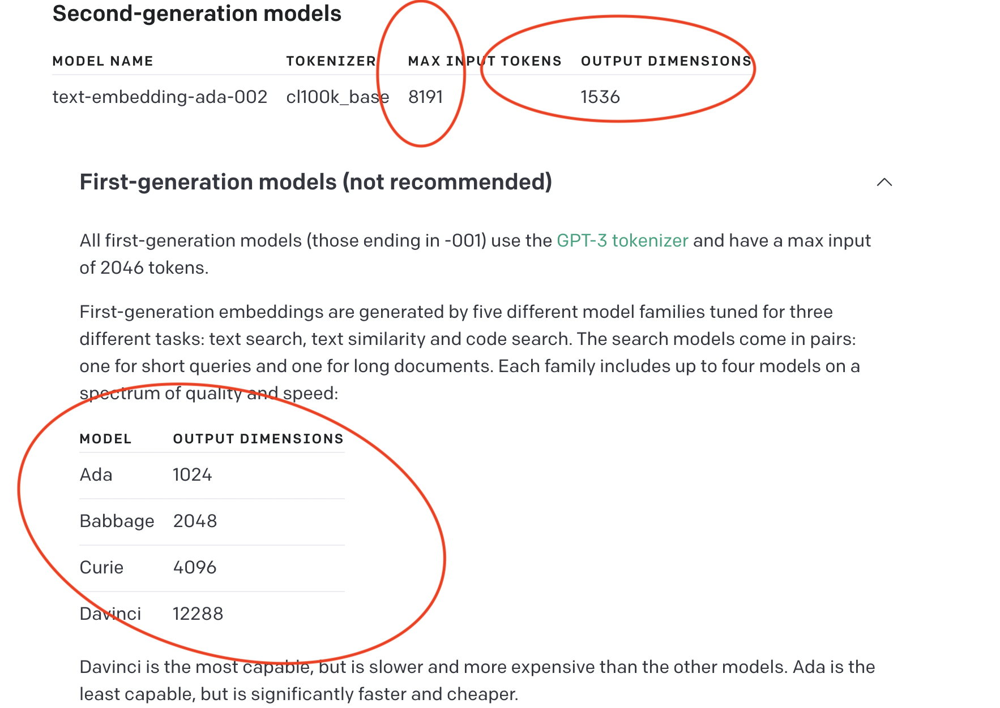
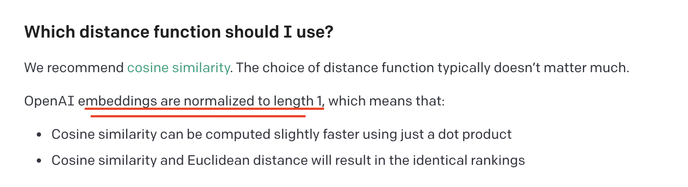
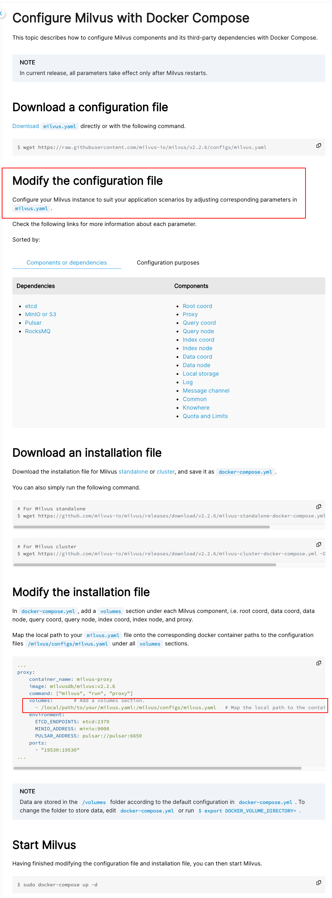

## poetry 2 requirements 2 pipenv
poetry2reqs.py

## Milvus
refer: https://milvus.io/docs/v2.0.x/install_standalone-docker.md

cd milvus_standalone

wget https://github.com/milvus-io/milvus/releases/download/v2.0.2/milvus-standalone-docker-compose.yml -O docker-compose.yml

sudo docker-compose up -d

sudo docker-compose ps

pytest ./tests/datastore/providers/milvus/test_milvus_datastore.py (run in pycharm, test not working!)

sudo docker-compose down

sudo rm -rf  volumes

## Milvus run test
cd examples/docker/milvus

sudo docker-compose up -d

sudo docker ps

pytest ./tests/datastore/providers/milvus/test_milvus_datastore.py (run in pycharm, test working)

## env variable
@ confs/gen_env_vars.py

## start server
@ server/main.py (use pycharm to run, not poetry run start)

## https://platform.openai.com/docs/guides/embeddings

### texts2embs

### euclidean dist vs cos sim vs dot prod vs l2 norm

### configure Milvus
refer to: https://milvus.io/docs/configure-docker.md
https://juejin.cn/post/6966524585458171940

cd examples/docker/milvus

wget https://raw.githubusercontent.com/milvus-io/milvus/v2.2.5/configs/milvus.yaml

